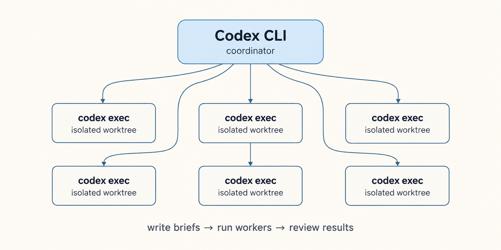

# Codex Fan-Out


**Fan work out to headless `codex exec` workers in isolated Git worktrees, up to six at once.**

> The worker does the bulk, you keep the judgement.

Fan-out is dispatching many independent workers at once and reviewing what comes back. The Codex CLI coordinator loads this skill and starts the workers; each worker is a headless `codex exec` process running in its own Git worktree.



*Codex CLI coordinator writes briefs, dispatches `codex exec` workers into isolated Git worktrees, and reviews the resulting reports.*

## Table of Contents

<details>
  <summary>Expand</summary>
  <ol>
    <li><a href="#what-it-does">What It Does</a></li>
    <li><a href="#installation">Installation</a></li>
    <li><a href="#quick-start">Quick Start</a></li>
    <li><a href="#which-model-to-use">Which Model to Use</a></li>
    <li><a href="#how-it-stays-safe">How It Stays Safe</a></li>
    <li><a href="#what-it-cannot-do">What It Cannot Do</a></li>
    <li><a href="#under-the-hood">Under the Hood</a></li>
    <li><a href="#go-deeper">Go Deeper</a></li>
    <li><a href="#contributing">Contributing</a></li>
    <li><a href="#licence">Licence</a></li>
  </ol>
</details>

## What It Does

- **Codex CLI coordinator.** This skill is installed in the Codex CLI skills directory and is invoked as `$codex-fanout`. Codex CLI is the coordinator: it loads the skill, writes the brief, and dispatches the workers.
- **Headless `codex exec` workers in isolated Git worktrees.** Each worker is a `codex exec` process in one directory. It writes files inside its worktree and produces a JSONL log and a final report.
- **You write the brief, it writes the files, you review.** The brief carries the task and any repository-specific rules the worktree does not already state.
- **Up to six at once.** Launch them in parallel, each with its own brief, log, report, and worktree, and never let two workers write the same file.
- **Real output and exit codes.** `codex exec` gives you `--json`, a real exit code, `--output-last-message`, and `--sandbox` policies.

If a task needs your judgement or your conversation context, you do not need this skill.

## Installation

Clone into the Codex CLI skills directory, then restart or reload Codex CLI so the skill loads. It is available as `$codex-fanout` from then on.

```bash
git clone https://github.com/TolongLabs/codex-fanout "${CODEX_HOME:-$HOME/.codex}/skills/codex-fanout"
```

## Quick Start

1. **Check Codex CLI and authentication.** You need `codex` installed, authenticated, plus `jq` and `git`.

   ```bash
   codex --version
   codex login status
   ```

   If you are not logged in, run `codex login`.

2. **Choose a model** from the current Codex catalog:

   ```bash
   codex debug models | jq -r '.models[].slug'
   ```

   Use a model the user already named in the conversation; otherwise set `MODEL` to one of the slugs above.

3. **Create a worktree.** Never dispatch into the main checkout. Replace `main` with your default branch if it is different.

   ```bash
   mkdir -p .worktrees
   git worktree add -b fanout-test ./.worktrees/wt-a main
   WORKTREE="$(pwd)/.worktrees/wt-a"
   BRIEF="$WORKTREE/brief.md"
   REPORT="$WORKTREE/report.md"
   LOG="$WORKTREE/worker.log"
   ERR="$WORKTREE/worker.err"
   ```

4. **Write the brief** to `$BRIEF`. It must name every file to edit, say "and nothing else", and say "do not run git".

5. **Dispatch.**

   ```bash
   timeout 1500 codex exec \
     -C "$WORKTREE" \
     -m "$MODEL" \
     --ignore-user-config \
     --ignore-rules \
     --ephemeral \
     --sandbox workspace-write \
     --json \
     --output-last-message "$REPORT" \
     - < "$BRIEF" \
     > "$LOG" 2> "$ERR"
   STATUS=$?
   ```

6. **Verify.**

   ```bash
   test -f "$REPORT"
   jq -R 'fromjson?' "$LOG" | grep -E '"type":"error"' || true
   grep -iE "denied|blocked|refused" "$ERR" || true
   git -C "$WORKTREE" status --porcelain
   <run the relevant test command in "$WORKTREE">
   grep -RIn -E '/home/|C:\\Users|/tmp/' "$WORKTREE"
   ```

The cost or token metadata in the JSONL log is not an invoice. Do not quote it.

## Which Model to Use

Only models in the `openrouter` block of the proxy config are offered, and `glm-5.3-flash` is the default: every
measurement in this README was taken on it. Any of these is cheap enough to be a worker; prices are OpenRouter's on
2026-09-07, so re-check before relying on one.

| OpenRouter id                       | Input / output per 1M tokens | Context | Notes                                    |
| ----------------------------------- | ---------------------------- | ------- | ---------------------------------------- |
| `z-ai/glm-5.3-flash`                | $0.075 / $0.25               | 1.3M    | The default; measured in this file       |
| `qwen/qwen3.7-flash`                | $0.03 / $0.13                | 1M      | Cheapest capable option                  |
| `deepseek/deepseek-v4-flash`        | $0.08 / $0.16                | 1M      | Cheap output, long context               |
| `qwen/qwen3-coder-30b-a3b-instruct` | $0.07 / $0.28                | 262k    | Coder-tuned                              |
| `google/gemini-2.5-flash-lite`      | $0.10 / $0.40                | 1M      | Fast                                     |
| `minimax/minimax-m3`                | $0.30 / $1.20                | 1M      | The step-up when flash models fall short |

## How It Stays Safe

A worker runs under one of three sandbox modes:

| Flag / mode                                  | What it allows                              | Use when                                                                  |
| -------------------------------------------- | ------------------------------------------- | ------------------------------------------------------------------------- |
| `--sandbox read-only`                        | Reads the workspace; no writes              | Analysis, summaries, inventories                                          |
| `--sandbox workspace-write`                  | Edits inside the workspace                  | **The default.** Files in the worktree only; shell commands stay sandboxed |
| `--dangerously-bypass-approvals-and-sandbox` | Runs commands without approval or sandbox   | Only in a scratch directory or worktree you will throw away               |

- **Give a worker a Git worktree, never your checkout.** A half-done or looping run then costs one worktree removal, not a reconstruction, and two workers never share a working tree.
- **Say `do not run git` in every brief.** The worker can, and a commit from a worker is a commit nobody reviewed.
- **Never add interactive approval flags to a headless command.** Flags like `--approve-for-me` require an interactive terminal.
- **Never give two workers overlapping files.** Each gets its own worktree and its own brief.

## What It Cannot Do

- **The cost figure is not the upstream invoice.** The JSONL log may contain token or cost metadata; that is diagnostic, not a bill. Never quote it.
- **A worker has none of your context.** Everything it needs goes in the brief, and if the brief takes longer to write than the task takes to do, do the task.
- **Six concurrent workers is the ceiling.** Past that they contend for the same files and the review cost exceeds the saving.
- **A hung worker can burn the full timeout.** On a bad call, `codex exec` may retry; a looping worker burns the full budget. Wrap every dispatch in `timeout`.
- **It does not replace your judgement.** Review every output before you treat it as done.

## Under The Hood

Every worker is one command, and every failure shows up around it.

<details>
<summary><b>The Dispatch Command</b></summary>

```bash
timeout 1500 codex exec \
  -C "$WORKTREE" \
  -m "$MODEL" \
  --ignore-user-config \
  --ignore-rules \
  --ephemeral \
  --sandbox workspace-write \
  --json \
  --output-last-message "$REPORT" \
  - < "$BRIEF" \
  > "$LOG" 2> "$ERR"
STATUS=$?
```

- **`-C "$WORKTREE"`** selects the worker cwd. It must be an isolated Git worktree given as an absolute path.
- **`-m "$MODEL"`** is explicit because `--ignore-user-config` ignores the coordinator's default model.
- **`--ignore-user-config`** and **`--ignore-rules`** make the worker run with the repository rules that are in the brief only.
- **`--ephemeral`** prevents session files from being persisted to disk.
- **`--sandbox workspace-write`** is the normal worker sandbox: it can write files inside the worktree but not escape it.
- **`--json`** emits JSONL on stdout.
- **`--output-last-message "$REPORT"`** writes the worker's final message to a report file.
- **`- < "$BRIEF"`** reads the brief from a file on stdin. Put the brief in a file; inline prompts are shell-quoting archaeology.
- **`> "$LOG" 2> "$ERR"`** captures stdout and stderr separately.
- **`timeout`** protects against a worker that hangs on a long call or retry loop. Exit 124 means the timeout fired.

</details>

<details>
<summary><b>Failure Modes</b></summary>

| Symptom                                                  | Cause and fix                                                                                    |
| -------------------------------------------------------- | ------------------------------------------------------------------------------------------------ |
| Exit 124 and nothing written                             | The timeout fired. The worker hung or retried. Read `$ERR` and `$LOG` for the cause              |
| `denied`, `blocked`, or `refused` in `$ERR`              | The sandbox refused a command. Either run the command yourself or adjust the brief               |
| Report file missing                                      | The worker exited before the final message. Check `$LOG` and `$ERR` for the failure event        |
| JSONL contains error events                              | A tool call or model error happened during the run. Read the events in `$LOG`                    |
| `git status` shows unexpected files or a commit          | The brief did not say "and nothing else" or "do not run git". Check after every run              |
| `permission_denials` or sandbox refusals in the JSONL    | `workspace-write` refused a command outside the worktree. Keep the worker inside its worktree    |
| Model slug rejected by Codex                             | Catalogue drift. Re-list `codex debug models` rather than retrying the same slug                 |
| Stray machine paths in the deliverable                   | The brief did not say "read them, never mention their paths in your output". Filter before review |
| Worker wrote outside its worktree                        | The worktree path was not absolute or the wrong sandbox was used. Use `-C` with an absolute path  |

</details>

## Go Deeper

| Read                   | When                                                                                     |
| ---------------------- | ---------------------------------------------------------------------------------------- |
| [`SKILL.md`](SKILL.md) | You are writing a brief or a report: preflight, dispatch, verification and failure modes |

## Contributing

Issues and pull requests are welcome.

## Licence

MIT. Copyright 2026 TolongLabs.
